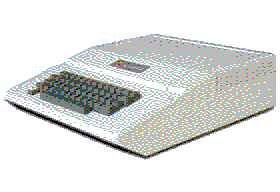
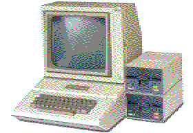
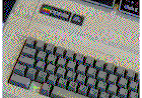

# Vintage Apple emulators and related software

<table style="padding:10 px;">
  <tr>
    <td></td>
    <td></td>
    <td></td>
  </tr>
  <tr>
    <td></td>
    <td></td>
    <td></td>
  </tr>
  <tr>
    <td></td>
    <td></td>
    <td></td>
  </tr>
</table>

## Requirements

[Homebrew](http://brew.sh).

## Installation

    brew tap lifepillar/appleii

## How to install formulas and casks

    brew install <formula or cask>

In some cases, a formula and a cask have the same name (e.g., `openemulator`).
You may pass `--formula` or `--cask` to `brew install` to disambiguate. Refer
to Homebrew's documentation for further details about these and other commands,
or if you are unfamiliar with the terminology.

Examples:

    brew install --formula openemulator
    brew install --cask openemulator
    brew install cadius
    brew install gsport

Some formulas or casks in this repository may already exist in Homebrew. In
such cases, if you want to refer to the formula or cask in this repository
(e.g., because it contains a more up to date version), you must use
`lifepillar/homebrew-appleii/<name>`. For instance:

    brew upgrade lifepillar/homebrew-appleii/clock-signal

## Contributions

They are welcome! If you know of some program that is not included here, please
let me know! Even better, open a pull request!

## More Software

Some software relevant to the community interested in this repository is not
found in this repository because it is already in Homebrew Core. That includes:

- [cc65](https://cc65.github.io/cc65/): `brew install cc65`
- [Clock Signal](https://github.com/TomHarte/CLK): `brew install clock-signal`
- [exomizer](https://bitbucket.org/magli143/exomizer/wiki/Home): `brew install exomizer`
- [Virtual \]\: `brew install virtual-ii`

## Credits

The images in this repository have been generated with B. Buckels's `b2d` and
`a2b` programs. Original files are all from
[apple-history](http://apple-history.com), with the exception of the Apple I
(original from
[Wikipedia](https://en.wikipedia.org/wiki/File:Apple_I_Computer.jpg)) and the
Apple ][e (courtesy of [W.
Warby](https://www.flickr.com/photos/wwarby/16614254568/)). The picture of Jobs
and Woz is in so many places that I don't know whether it is copyrighted or may
be considered in the public domain.
