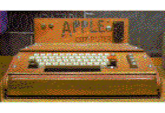
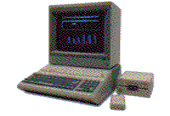
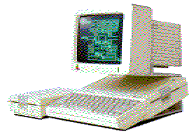
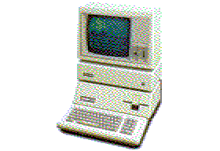
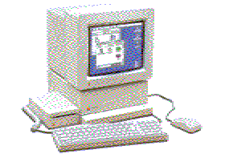

# Vintage Apple emulators and related software

[![Apple \]\](http://apple-history.com/aii)
[![Apple \]\[+](images/ii+.png "Apple II+")](http://apple-history.com/aiiplus)
[![Apple \]\[e](images/iie.png "Apple IIe")](http://apple-history.com/aiie)

## Requirements

[Homebrew](http://brew.sh), [Homebrew Cask](http://caskroom.io) (optional, for casks only).

## Installation

    brew tap lifepillar/appleii

## How to install formulas

For Homebrew formulas (programs built from source and/or launched
from the command line) use:

    brew install <formula name>

For casks (files inside the `Casks` folder, which install
already built GUI applications) use:

    brew cask install <cask name>

Example:

    brew install openemulator --HEAD
    brew linkapps openemulator
    brew cask install gsport

Refer to the documentation of Homebrew and Homebrew Cask for
further details about these and other commands.

## Contributions

They are welcome! If you know of some program that is
not included here, please let me know!

## FAQ

_Why isn't [cc65](https://cc65.github.io/cc65/) in this repository?_

cc65 is already in Homebrew! (`brew install cc65`)

_Why isn't [Virtual \]\ in this repository?_

Virtual ][ is already in Homebrew Cask! (`brew cask install virtual-ii`)

## Credits

The images in this repository have been generated with B. Buckels's `b2d` and
`a2b` programs. Original files are all from
[apple-history](http://apple-history.com), with the exception of the Apple I
(original from
[Wikipedia](https://en.wikipedia.org/wiki/File:Apple_I_Computer.jpg)) and the
Apple ][e (courtesy of [W.
Warby](https://www.flickr.com/photos/wwarby/16614254568/)). The last picture
(Jobs and Woz) is in so many places that I don't know whether it is copyrighted
or may be considered in the public domain.

## Off-topic: online emulators

- [Virtual Apple \]\
- [Apple \]\[js and Apple \]\[jse](https://www.scullinsteel.com/apple/about.html)
- [Apple2JS](http://www.megidish.net/apple2js/)
- [Apple \]\[+](http://porkrind.org/a2/)
- [appletoo](https://github.com/nicholasbs/appletoo)

